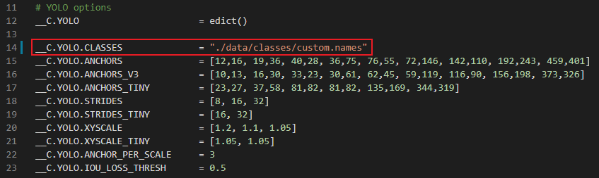

# Pyinstaller-OpenVINO-Norfair-Object-Detection-Tracking using custom YOLOv4 License Plate Detection model

## Guide to convert custom YOLOv4 model to OpenVINO (IR) format

### Convert yolov4 model (.weights) into Tensorflow (.pb) format

Download yolov4 .weights, .config, and .names files

https://drive.google.com/file/d/1ffeOmcTy7yDPOXSgrr_lR2bNSIBJCZK3/view?usp=sharing

Download video for inference

https://drive.google.com/file/d/1xxcud0qlQ4xcEgrjNntLGmNlxncuTZRU/view?usp=sharing

Clone the repo below & cd into it

https://github.com/theAIGuysCode/tensorflow-yolov4-tflite.git

Create and activate YOLOv4 Virtual environment.

```
python -m venv tf-yolov4
.\tf-yolov4\Scripts\activate
```

Install requirements

```
pip install -r requirements.txt
```

Edit __C.YOLO.CLASSES in '.\core\config.py' to path to appropriate classes
<p align="center"></p>

Place downloaded yolov4 model in '.\data'

Convert yolov4 model to TF format

```
python save_model.py --weights .\data\custom.weights --output .\checkpoints\custom-416 --input_size 416 --model yolov4 
```

### Convert Tensorflow (.pb) model into Openvino IR model (.xml) format and run inference

Clone this repo & cd into it

Create and activate Openvino Virtual environment.

```
python -m venv yolov4-openvino
.\yolov4-openvino\Scripts\activate
```

Install requirements

```
pip install -r requirements.txt
```
Extract github.rar into repo

Move all files from'.\checkpoints\custom-416' in to '.\openvino\public\yolo-v4-tf\yolo-v4.savedmodel'

Move downloaded custom.weights file to '\openvino\public\yolo-v4-tf'

Convert yolov4 model to Openvino(IR) format

```
omz_converter --name yolo-v4-tf --download_dir openvino --precisions FP32
```

## Build Pyinstaller '.exe' file
Install Pyinstaller

```
pip install pyinstaller
```

Create and add files to '.spec' file and build the executable file

```
pyinstaller --add-data "lp.mp4;." --add-data "openvino\public\yolo-v4-tf\FP32\yolo-v4-tf.xml;." --add-data "obj.names;." --add-data "C:\Users\sapen\Desktop\Workspace\Roc4Tech\openvino\Lib\site-packages\openvino\;." --onefile openvino_norfair_object_detection.py
```
NB: Refer to this link for commands to customize .spec file: 'https://pyinstaller.org/en/stable/usage.html#what-to-bundle-where-to-search'

If build was successful, two folders will be created: build and dist. Inside the 'dist' folder you'll find the executable(.exe) file.

Run '.exe' file

```
.\dist\openvino_norfair_object_detection
```
